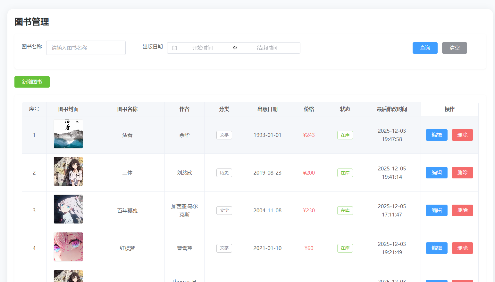
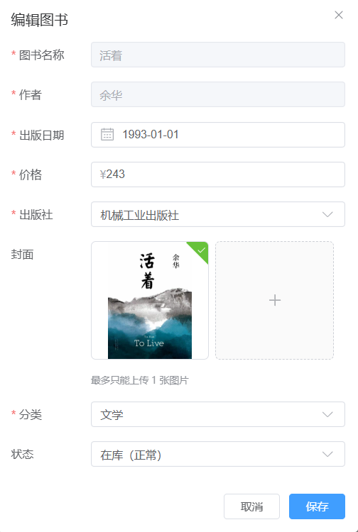
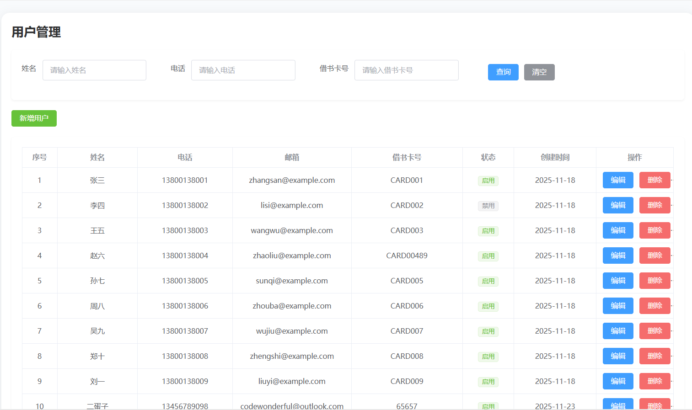
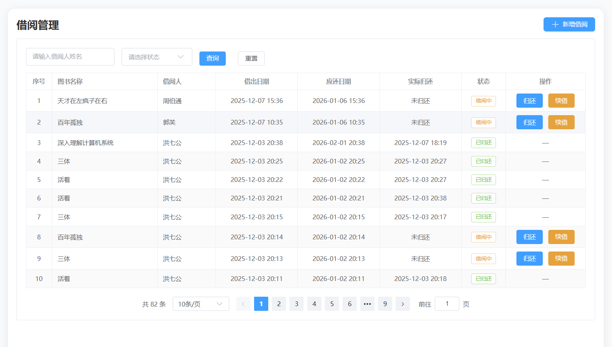
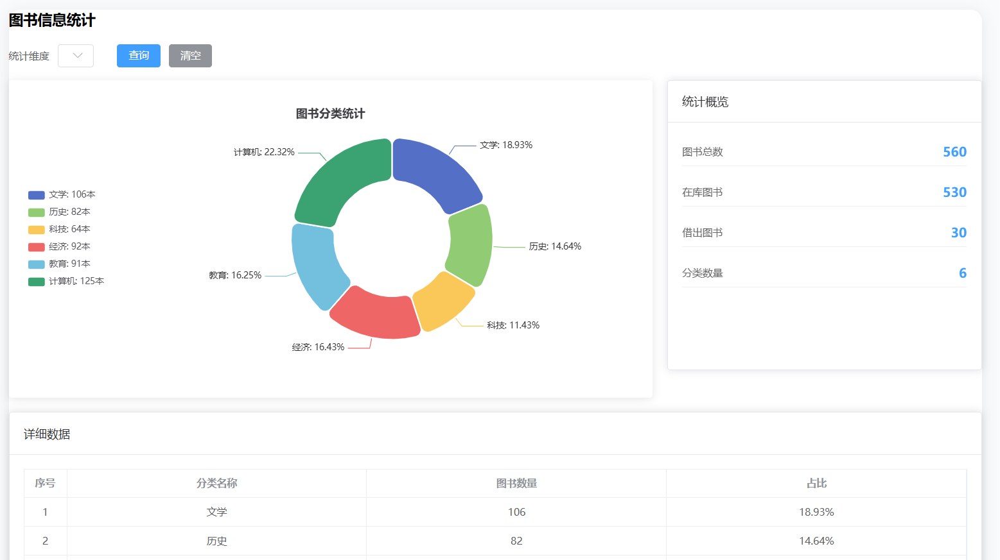
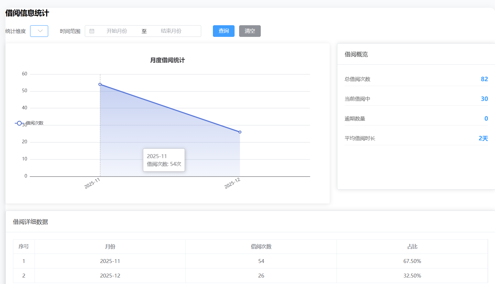

# 📚 图书管理系统

一个基于前后端分离架构的图书管理平台，支持图书信息的增删改查、封面上传、分类与出版社管理等功能。项目采用现代化技术栈，代码结构清晰，易于部署与二次开发。

---

## 🌟 功能特性

- ✅ 图书 CRUD 操作（创建、读取、更新、删除）
- ✅ 支持图书封面图片上传（限制：仅 JPG/PNG/GIF，≤5MB）
- ✅ 按图书名称、出版日期范围进行搜索
- ✅ 图书状态管理（“在库” / “已下架”）
- ✅ 关联管理：分类（Category）与出版社（Publisher）
- ✅ 响应式 UI，基于 Element Plus 组件库
- ✅ 前后端完全分离，RESTful API 设计
- ✅ 后端采用异步编程（async/await），提升性能与可伸缩性

---
## 🖼 界面预览

---
## 🛠 技术栈

### 前端（Frontend）
- **框架**：Vue 3 (Composition API + `<script setup>`)
- **UI 库**：Element Plus
- **构建工具**：Vite
- **状态管理**：轻量级，直接使用 `ref`/`reactive`
- **HTTP 客户端**：Axios

### 后端（Backend）
- **语言**：C#
- **框架**：ASP.NET Core Web API (.NET 8)
- **数据库**：Microsoft SQL Server
- **ORM**：Entity Framework Core
- **异步支持**：全程使用 `async/await`
- **文件处理**：使用阿里云的OOS（图片上传）

### 数据库
- **系统**：SQL Server（建议 2019+）
- **迁移方式**：手动建表也可以 Code First

---

## 📦 项目结构（简要）

